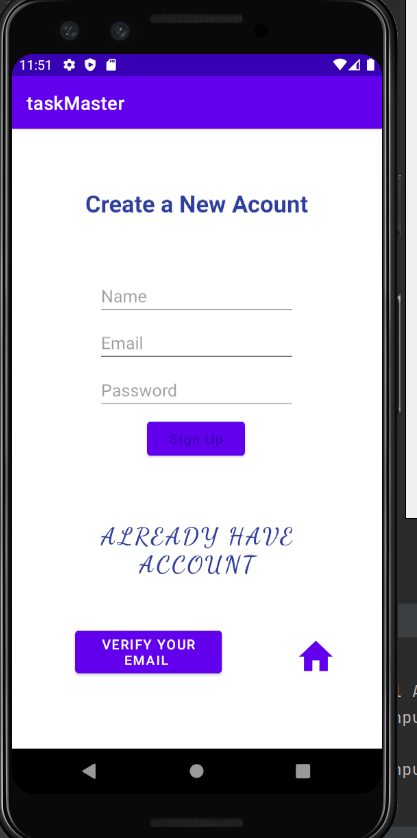
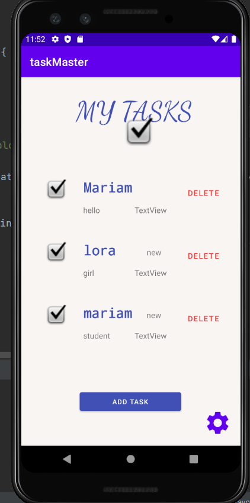
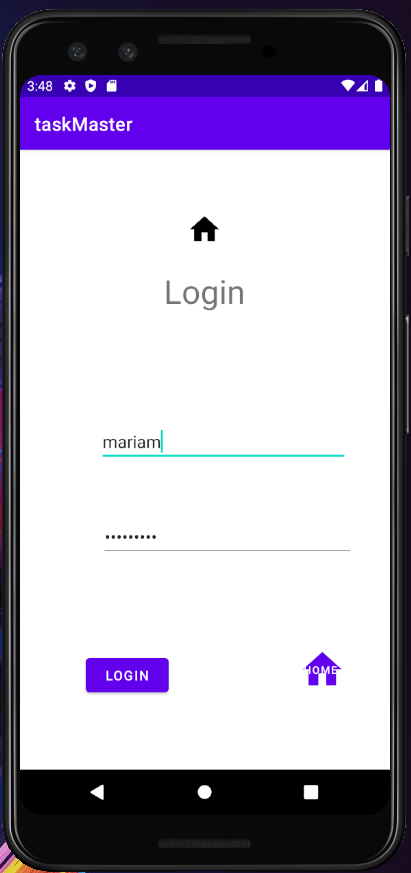
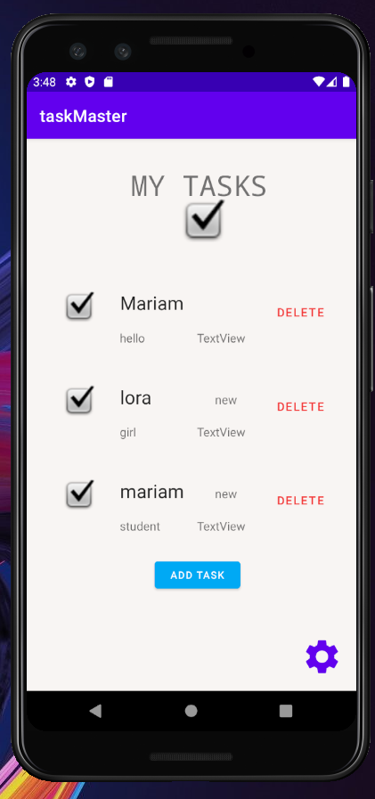
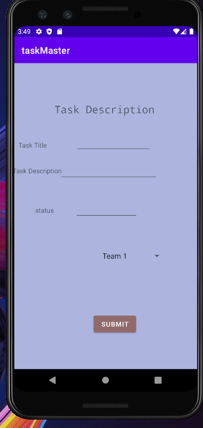

# taskMaster

## OverView 
I’ll start building an Android app that will allow the user to manage the tasks , add Task title and description.
 It’s a task-tracking application with the same basic goal as Trello: allow users to keep track of tasks to be done and their status.
 
 # Daily blog / Feature tasks
   * **Aug 25,2021**
   Tracking Users
Add Analytics to your amplify project. Create and send an Event whenever you launch intents that start new activities.
 
   * **Aug 24,2021**

 Notifications on Task Creation
When a new task is created within a team, alert all users who are a part of that team about that new task.

There are several steps involved in allowing this to work:

Store which team a user is part of in the cloud
Add a Lambda trigger on task creation
Use SNS to send a notification as part of that Lambda
 
   * **Aug 19,2021**

Uploads
On the “Add a Task” activity, allow users to optionally select a file to attach to that task. If a user attaches a file to a task, that file should be uploaded to S3, and associated with that task.

Displaying Files
On the Task detail activity, if there is a file that is an image associated with a particular Task, that image should be displayed within that activity. (If the file is any other type, you should display a link to it.)
 
   * **Aug 18,2021**
   Feature Tasks
User Login
Add Cognito to your Amplify setup. Add in user login and sign up flows to your application, using Cognito’s pre-built UI as appropriate. Display the logged in user’s username somewhere relevant in your app.

User Logout
Allow users to log out of your application.
 
  * **Aug 17,2021**
App Polish
Ensure that your application follows Google’s guidelines.

Build Final APK
Build an APK for your application. Include that APK in your GitHub repo.

Deployment to Play Store

 * **Aug 16,2021
 Tasks Are Owned By Teams
Create a second entity for a team, which has a name and a list of tasks. Update your tasks to be owned by a team.

Manually create three teams by running a mutation exactly three times in your code. (You do NOT need to allow the user to create new teams.)

Add Task Form
Modify your Add Task form to include either a Spinner or Radio Buttons for which team that task belongs to.

Settings Page
In addition to a username, allow the user to choose their team on the Settings page. Use that Team to display only that team’s tasks on the homepage.
 
 
 * **Aug 13,2021 
 Tasks Are Cloudy
Using the amplify add api command, create a Task resource that replicates our existing Task schema. Update all references to the Task data to instead use AWS Amplify to access your data in DynamoDB instead of in Room.

Add Task Form
Modify your Add Task form to save the data entered in as a Task to DynamoDB.

Homepage
Refactor your homepage’s RecyclerView to display all Task entities in DynamoDB.
 
 * **Aug 12,2021**
 Espresso and Polish
 
 
 * **Aug 11,2021**
 Task Model and Room
Following the directions provided in the Android documentation, set up Room in your application, and modify your Task class to be an Entity.

Add Task Form
Modify your Add Task form to save the data entered in as a Task in your local database.

Homepage
Refactor your homepage’s RecyclerView to display all Task entities in your database.

Detail Page
Ensure that the description and status of a tapped task are also displayed on the detail page, in addition to the title. (Note that you can accomplish this by passing along the entire Task entity, or by passing along only its ID in the intent.)
 
 * **Aug 10,2021**
 Task Model
Create a Task class. A Task should have a title, a body, and a state. The state should be one of “new”, “assigned”, “in progress”, or “complete”.

Homepage
Refactor your homepage to use a RecyclerView for displaying Task data. This should have hardcoded Task data for now.

Some steps you will likely want to take to accomplish this:

Create a ViewAdapter class that displays data from a list of Tasks.
In your MainActivity, create at least three hardcoded Task instances and use those to populate your RecyclerView/ViewAdapter.
Ensure that you can tap on any one of the Tasks in the RecyclerView, and it will appropriately launch the detail page with the correct Task title displayed.
 
* **Aug 9 , 2021**
 Create a Task Detail page. It should have a title at the top of the page, and a Lorem Ipsum description.

Settings Page
Create a Settings page. It should allow users to enter their username and hit save.

Homepage
The main page should be modified to contain three different buttons with hardcoded task titles. When a user taps one of the titles, it should go to the Task Detail page, and the title at the top of the page should match the task title that was tapped on the previous page.

The homepage should also contain a button to visit the Settings page, and once the user has entered their username, it should display “{username}’s tasks” above the three task buttons.
 
 
 
## My App

